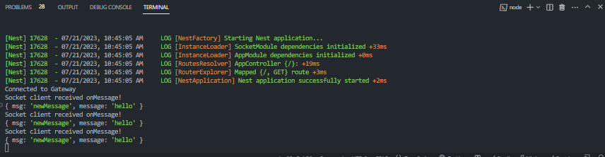

# Tạo một Websocket server

> npm i --save @nestjs/websockets @nestjs/platform-socket.io


**Tạo một folder gateway, bỏ module gateway vào**
```ts
import { Module } from '@nestjs/common';
import { MyGateway } from './gateway';

@Module({
  providers: [MyGateway],
})
export class GatewayModule {}
```
**Tạo gateway.ts bỏ vào providers của module**
```ts
import { OnModuleInit } from '@nestjs/common';
import {
  MessageBody,
  SubscribeMessage,
  WebSocketGateway,
  WebSocketServer,
} from '@nestjs/websockets';
import { Server } from 'socket.io';
//Tạo gateway 
@WebSocketGateway({
  cors: {
    origin: ['http://localhost:4000'], //port 4000 là front end chạy
  },
})
export class MyGateway implements OnModuleInit {
  @WebSocketServer() //Tạo một server socket
  server: Server;

  onModuleInit() {
    //server.on là một event listener, khi có một client connect tới server thì sẽ emit event connection, event connection (mặc định) này sẽ được server lắng nghe và thực hiện một hành động 
    this.server.on('connection', (socket) => {
      console.log(socket.id);
      console.log('Connected');
    });
  }
//subcribe message dựa trên tên event mà client emit tới server
  @SubscribeMessage('newMessage')
  onNewMessage(@MessageBody() body: any) {
    console.log(body);
    this.server.emit('onMessage', {
      msg: 'New Message',
      content: body,
    });
    //khi server nhận được newMessage event từ một client, nó sẽ emit lại 1 event onMessage tới tất cả
    //các client đang connect tới server
  }
}
```

Ta dùng postman tạo một Websocket Protocol request
WebSocket is a communication protocol that provides full-duplex, bidirectional communication channels over a single TCP connection. It allows web browsers and servers to establish a long-lived connection that enables real-time data transfer without the overhead of traditional HTTP connections. WebSocket is commonly used in web applications, online gaming, chat applications, financial trading platforms, and other scenarios where real-time communication is essential.

Websocket là 1 protocol giao tiếp cung cấp:
- Full-duplex: cả server và client đều có thể send và nhận cùng một lúc 
- Bidirectional: 2 chiều, server có thể flow 2 direction, server to client and client to server 


Ta connect tới port mà websocket server đang hoạt động, phần code subribe message sẽ được gọi khi có message của client được emit tới server và ngược lại server cũng có thể emit một event mà client có thể subcribe (listen) để nhận được message


**Client gửi một message tới server**


***Server sau đó emit một vent là 'onMessage' tới tất cả các client đang connect tới server, client nào mà listen tới event này sẽ nhận được message***


# Tạo một socket io client

**Ta tạo một server mới để create một socket io client ở port 3001**
> npm i --save socket.io-client

socket-client.ts
```ts
import { Injectable, OnModuleInit } from '@nestjs/common';
import { io, Socket } from 'socket.io-client';

@Injectable()
export class SocketClient implements OnModuleInit {
    //Tạo một socket client
  public socketClient: Socket;

  constructor() {
    //connect tới port 3000 là port của socket io server
    this.socketClient = io('http://localhost:3000');
  }

  onModuleInit() {
    //đăng ký consumer 
    this.registerConsumerEvents();
  }

  private registerConsumerEvents() {
    
    //khi socket client connect tới server
    //thì server sẽ emit event connection
    // ở bên client thì event là 'connect' còn ở bên server thì event là 'connection'
    this.socketClient.on('connect', () => {
      console.log('Connected to Gateway');
    });
    //khi server emit event onMessage thì client sẽ nhận được message
    // .on nghĩa là listen tới event
    this.socketClient.on('onMessage', (payload: any) => {
      console.log('Socket client received onMessage!');
      console.log(payload);
    });
  }
}

```



client nhận được message từ server khi server emit event onMessage (khi server nhận được một event newMessage từ client, ở đây là postman) => lúc này sẽ client sẽ tiêu thụ được message từ server


# Code front end react

**Đầu tiên ta tạo một context cho client**

WebSocketContext.tsx
```tsx

import { createContext } from 'react';
import { io, Socket } from 'socket.io-client';

export const socket = io('http://localhost:3001'); //port 3001 là port của socket client
export const WebsocketContext = createContext<Socket>(socket); //tạo một context cho socket client
export const WebsocketProvider = WebsocketContext.Provider;
```


App.tsx
```tsx
import React from 'react';
import logo from './logo.svg';
import './App.css';
import { socket, WebsocketProvider } from './contexts/WebsocketContext';
import { Websocket } from './components/Websocket';

function App() {
  return (
    <WebsocketProvider value={socket}>
      <Websocket />
    </WebsocketProvider>
  );
}

export default App;
```


websocket.tsx
```tsx
import { useContext, useEffect, useState } from 'react';
import { WebsocketContext } from '../contexts/WebsocketContext';
//Định nghĩa kiểu dữ liệu cho message
type MessagePayload = {
  content: string;
  msg: string;
};

export const Websocket = () => {
  const [value, setValue] = useState('');
  const [messages, setMessages] = useState<MessagePayload[]>([]);
  const socket = useContext(WebsocketContext); //lấy socket client từ context
//Khi component mount thì sẽ register event
  useEffect(() => {
    //register event connect tới server
    socket.on('connect', () => {
      console.log('Connected!');
    });
    
    //register event onMessage, khi server emit event onMessage thì client sẽ nhận được message
    socket.on('onMessage', (newMessage: MessagePayload) => {
      console.log('onMessage event received!');
      console.log(newMessage);
      setMessages((prev) => [...prev, newMessage]);
      //ta sẽ set lại state messages, khi state messages thay đổi thì component sẽ re-render
    });
    //unregister event khi component unmount
    return () => {
      console.log('Unregistering Events...');
      // hàm off để unregister event
      socket.off('connect');
      socket.off('onMessage');
    };
  }, []);

  const onSubmit = () => {
    //khi người dùng nhấn button submit thì sẽ emit event newMessage tới server
    // ở server lúc này sẽ cài đặt một event listener để lắng nghe event newMessage
    // khi server nhận được event newMessage thì sẽ emit event onMessage tới tất cả các client đang connect tới server
    socket.emit('newMessage', value);
    setValue('');
  };

  return (
    <div>
      <div>
        <h1>Websocket Component</h1>
        <div>
          {messages.length === 0 ? (
            //nếu không có message nào thì hiển thị No Messages
            <div>No Messages</div>
          ) : (
            <div>
              {messages.map((msg) => (
                //hiển thị message
                <div>
                  <p>{msg.content}</p>
                </div>
              ))}
            </div>
          )}
        </div>
        <div>
          <input
            type="text"
            value={value}
            onChange={(e) => setValue(e.target.value)}
          />
          <button onClick={onSubmit}>Submit</button>
        </div>
      </div>
    </div>
  );
};
```