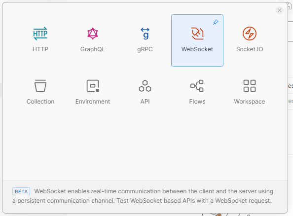

# Create Websocket

> npm i --save @nestjs/websockets @nestjs/platform-socket.io


**Tạo một folder gateway, bỏ module gateway vào**
```ts
import { Module } from '@nestjs/common';
import { MyGateway } from './gateway';

@Module({
  providers: [MyGateway],
})
export class GatewayModule {}
```
**Tạo gateway.ts bỏ vào providers của module**
```ts
import { OnModuleInit } from '@nestjs/common';
import {
  MessageBody,
  SubscribeMessage,
  WebSocketGateway,
  WebSocketServer,
} from '@nestjs/websockets';
import { Server } from 'socket.io';

@WebSocketGateway({
  cors: {
    origin: ['http://localhost:3000'],
  },
})
export class MyGateway implements OnModuleInit {
  @WebSocketServer()
  server: Server;

  onModuleInit() {
    this.server.on('connection', (socket) => {
      console.log(socket.id);
      console.log('Connected');
    });
  }

  @SubscribeMessage('newMessage')
  onNewMessage(@MessageBody() body: any) {
    console.log(body);
    this.server.emit('onMessage', {
      msg: 'New Message',
      content: body,
    });
  }
}
```

Ta dùng postman tạo một Websocket Protocol request
WebSocket is a communication protocol that provides full-duplex, bidirectional communication channels over a single TCP connection. It allows web browsers and servers to establish a long-lived connection that enables real-time data transfer without the overhead of traditional HTTP connections. WebSocket is commonly used in web applications, online gaming, chat applications, financial trading platforms, and other scenarios where real-time communication is essential.

Websocket là 1 protocol giao tiếp cung cấp:
- Full-duplex: cả server và client đều có thể send và nhận cùng một lúc 
- Bidirectional: 2 chiều, server có thể flow 2 direction, server to client and client to server 



Ta connect tới port mà websocket server đang hoạt động, phần code subribe message sẽ được gọi khi có message của client được emit tới server và ngược lại server cũng có thể emit một event mà client có thể subcribe (listen) để nhận được message


**Client gửi một message tới server**


***Server sau đó emit một vent là 'onMessage' tới tất cả các client đang connect tới server, client nào mà listen tới event này sẽ nhận được message***
